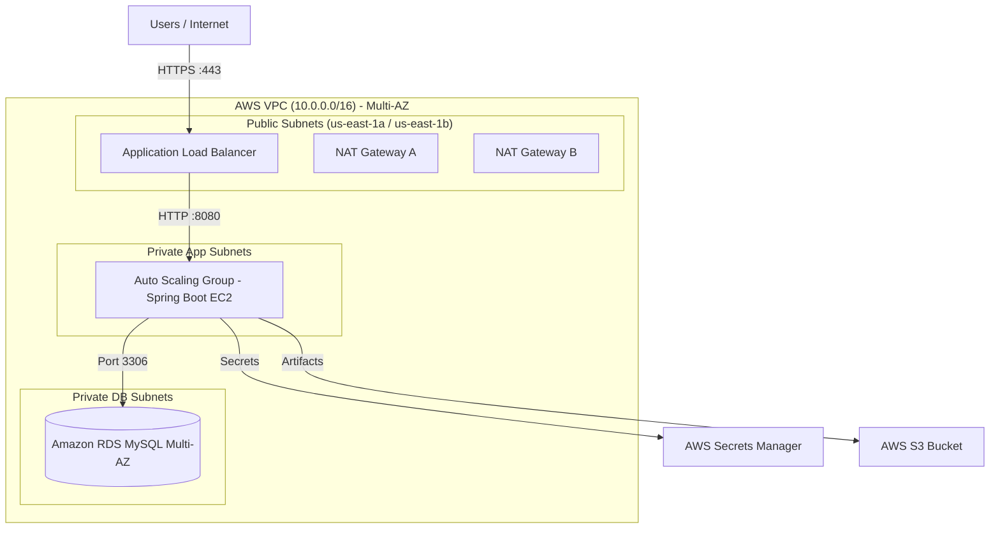
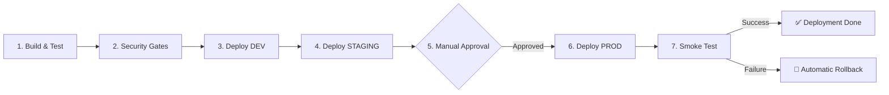

# 🐾 Spring PetClinic — Déploiement Automatisé CI/CD & GitOps sur AWS


---

## 📌 Présentation du Projet

Ce projet s'inscrit dans le cadre du **TP4 — Automatiser le déploiement de Spring PetClinic** (Module *AWS Architecting Avancé*, **ISI Dakar**). 

L'objectif est d'industrialiser l'application Java Spring Boot en mettant en œuvre une chaîne de **CI/CD complète, sécurisée et basée sur les principes GitOps**. L'infrastructure AWS sous-jacente est entièrement gérée sous forme de code (*Infrastructure as Code*) avec **Terraform**.

---

## 🏗️ Architecture Cloud AWS (Multi-AZ)

L'infrastructure déployée sur AWS (Région `us-east-1`) respecte les meilleures pratiques du **Well-Architected Framework** :



### Composants Clés de l'Infrastructure
- **VPC Multi-AZ** : Sous-réseaux Publics, Privés Application et Privés Base de données répartis sur 2 Zones de Disponibilité (`us-east-1a`, `us-east-1b`).
- **Application Load Balancer (ALB)** : Entrée HTTPS sécurisée (Terminaison TLS) avec redirection automatique du HTTP vers le HTTPS.
- **Auto Scaling Group (ASG)** : Haute disponibilité applicative (2 instances min, 4 max) avec politique de mise à l'échelle basée sur le CPU.
- **Amazon RDS MySQL Multi-AZ** : Base de données relationnelle haute disponibilité avec basculement automatique.
- **AWS Secrets Manager & KMS** : Stockage et chiffrement centralisé des identifiants et clés de sécurité.

---

## 🔄 Pipeline CI/CD & Boucle GitOps

Le pipeline d'automatisation est propulsé par **GitHub Actions** (`.github/workflows/deploy.yml`).



### Étapes du Pipeline :
1. **Build & Package** : Compilation Maven et génération du fichier JAR (`spring-petclinic-4.0.0-SNAPSHOT.jar`).
2. **Portes de Sécurité (Security Gates)** : Validation du code et contrôle Checkstyle / NoHTTP.
3. **Chaîne de Promotion Multi-Environnements** :
   - Déploiement automatique sur **DEV**.
   - Déploiement et tests sur **STAGING**.
   - **Approbation Manuelle** (*Required Reviewers*) avant d'autoriser la livraison en **PRODUCTION**.
4. **Déploiement Rolling & Zero-Downtime** : Utilisation d'*Instance Refresh* sur l'ASG AWS.
5. **Smoke Test & Rollback Automatique** : Vérification de la santé via `/actuator/health`. En cas d'échec, annulation automatique (*cancel-instance-refresh*).

---

## 🎯 Défis Relevés (Well-Architected Framework)

| Défi | Intitulé | Pilier | Implémentation |
| :--- | :--- | :--- | :--- |
| **Défi 1** | **Déploiement sans interruption** | Fiabilité | Stratégie Rolling Update sur l'ASG (`min_healthy_percentage = 100`, `max_healthy_percentage = 200`). |
| **Défi 2** | **Rollback automatique** | Fiabilité | Alarme CloudWatch `5XX` déclenchant l'annulation automatique de l'Instance Refresh si le Smoke Test échoue. |
| **Défi 4** | **Portes de sécurité (Security Gates)** | Sécurité | Contrôles Checkstyle / NoHTTP intégrés au build et règles IAM moindres privilèges. |
| **Défi 5** | **Promotion Multi-environnement** | Excell. Op. | Chaînage des environnements `dev` → `staging` → `prod` avec approbation obligatoire (*Required Reviewers* sur GitHub). |

---

## 💻 Exécution en Local

### Prérequis
- Java 17+ (JDK)
- Git & Maven

### Cloner et Lancer l'Application
```bash
git clone https://github.com/Bammite/spring-petclinic.git
cd spring-petclinic
./mvnw spring-boot:run
```
L'application sera accessible sur [http://localhost:8080](http://localhost:8080).

### Tester la validation du Build
```bash
./mvnw clean package -DskipTests
```

---

## 📂 Structure du Dépôt

```text
├── .github/workflows/
│   └── deploy.yml          # Pipeline CI/CD GitHub Actions
├── terraform/
│   ├── main.tf             # Provider AWS & backend
│   ├── vpc.tf              # Réseau VPC Multi-AZ
│   ├── alb.tf              # Application Load Balancer
│   ├── asg.tf              # Auto Scaling Group & Alarme Rollback
│   ├── rds.tf              # Database MySQL Multi-AZ
│   ├── secrets.tf          # Secrets Manager & KMS
│   └── outputs.tf          # URLs et endpoints générés
├── pom.xml                 # Configuration Maven & Checkstyle
├── README.md               # Documentation du projet
└── rapport_justification.html # Rapport complet de présentation
```

---

## 👥 Binôme & Auteurs

- **Prince Yembouam YENHAMME BAMMITE**
- **Josephine MOUNTOU MAFOUKA**
- **Bineta DIALLO**

*Sous la supervision de :* **Baye Sabarane LAM** — Cloud Infrastructure Engineer  
*Institution :* **ISI Dakar** — Master 1 Virtualisation, Cloud & Réseaux (2024-2025)
